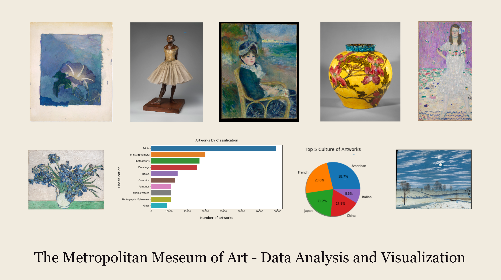

# The Metropolitan Museum of Art - Data Analysis and Visualization

    

This [notebook](https://github.com/margaretmz/met-museum-data-analysis/blob/master/Met_Art_Data_Analysis.ipynb) contains data analysis of the artists and artworks of the Metropolitan Museum of Art. 

## Project motivation
As I’m interested in using AI for art, analyzing the artist and artwork metadata of the Metropolitan Museum of Art helps me choose datasets for computer vision tasks.

## Medium Blog Post
The Medium blog I wrote is posted [here](https://medium.com/@margaretmz/metropolitan-museum-of-art-data-analysis-visualization-ea2f63c3fa04).

## Installation
I use Colab notebook which comes with the following pre-installed:
* Python 3.6
* Pandas
* Numpy
* Matplotlib
* Seaborn

## Acknowledgements
The metadata file is available on Kaggle [here](https://www.kaggle.com/metmuseum/the-metropolitan-museum-of-art-open-access).   
I downloaded the latest metadata csv file from GitHub [here](https://github.com/metmuseum/openaccess).  
Images were downloaded from the Metropolitan Museum of Art website [here](https://www.metmuseum.org/art/collection).

